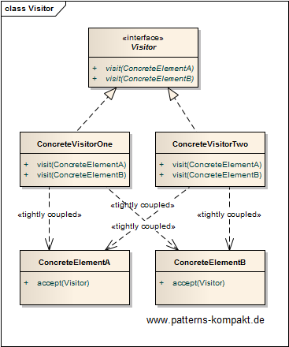
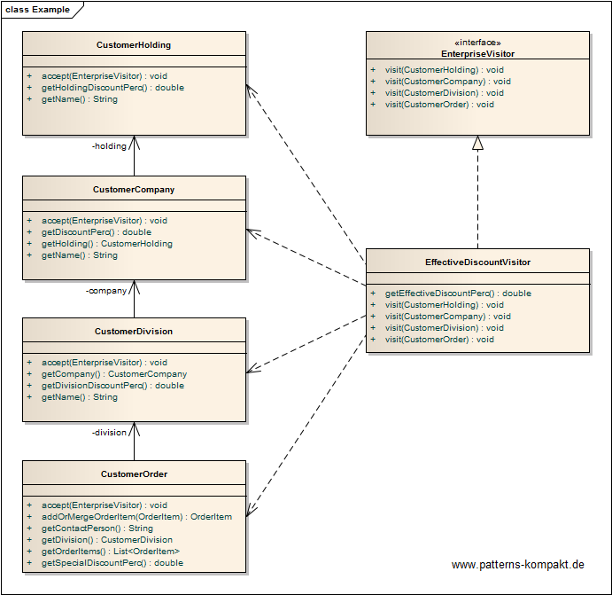
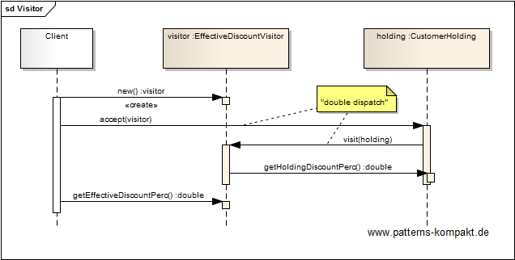

#### [Project Overview](../../../../../../../README.md)
----

# Visitor

## Scenario

Multiglom B2B, vendor of a CRM suite Manjok for small businesses, wants to rework the built-in support for discount management.

Manjok supports the mapping of various levels of a customer's enterprise. They are represented by a couple of entities, such as holding, company, division - down to a single business transaction, i.e. an order. Discounts can be negotiated on all these levels and there can be rules how to deal with combined or conflicting discounts when computing the effective discount. Today, the software only provides minor help with this problem and the new release shall improve this. However, due to the usual time pressure engineering wants to avoid any major restructuring/refactoring, if possible.

### Requirements Overview

The purpose of the discount calculator is the computation of the effective discount for each level a customer is represented in the system down to a single business transaction (order), taking into account any discounts negotiated on higher levels. 

_Main Features_

* Compute discount for a particular partner on any level (Holding, Company, Division, Order).

### Quality Goals

_Table 1. Quality Goals_

No.|Quality|Motivation
---|-------|----------
1|Minimally Invasiveness|Avoid any changes and retesting efforts to the existing class hierarchy.
2|Extendability|It shall be foreseen to add more levels in future, and there might follow additional discount computation models later.
3|Deferability|The solution shall allow a late decision whether to ship or not to ship the feature with the next release.

## Choice of Pattern
In this scenario we want to apply the **Visitor Pattern** to _represent an operation to be performed on the elements of an object structure. Visitor lets you define a new operation without changing the classes of the elements on which it operates._ (GoF). 

In this scenario the operation to be performed is the discount computation. The knowledge how to combine discounts shall not be mixed into the entities representing the different levels but kept separately to allow later replacement or different computation methods. Therefore we introduce the _EnterpriseVisitor_ interface and its first implementation, the _EffectiveDiscountVisitor_.

At runtime the _EffectiveDiscountVisitor_ goes bottom-up from the current position in the hierarchy (e.g. an order) to collect all negotiated discounts. With this data it computes the _effective discount_.

Only a minimal change will be made to 4 existing classes, the `visit()`-method for executing the _[double dispatch](https://en.wikipedia.org/wiki/Double_dispatch)_. All the logic sits inside the visitor. Alternatives can be implemented by adding another concrete EnterpriseVisitor. Thus, the visitor implementation can remain on a feature branch until the last responsible moment without impeding the other software development.

## Try it out!

Open [VisitorTest.java](VisitorTest.java) to start playing with this pattern. By setting the log-level for this pattern to DEBUG in [logback.xml](../../../../../../../src/main/resources/logback.xml) you can watch the pattern working step by step. This is especially useful to trace the _double dispatch_.

## Remarks
* While Visitor effectively decouples new operations from an existing class hierarchy without modifying it, a Visitor itself has a built-in smell: _it knows too much_ (with a tendency to grow). In this example the EnterpriseVisitor depends on Holding, Company, Division and Order. From the logical perspective this is ok, because the coherence regarding the aspect "discount computation" is maximal inside the _EffectiveDiscountVisitor_. On the other hand, any changes to these classes or any extension of the hierarchy cause cascading change effort - or can even lead to subtle incorrectness.
* In scenarios like the one depicted above you may want to consider a rule engine (e.g. [Drools](https://www.drools.org/)). It would also separate the discount computation logic from the entities and make it _declarative_.
* :cactus: The Visitor pattern is not "everydayish" (other than for example a decorator or an iterator), and worse, it is not very intuitive. Thus, I strongly recommend to double-check the motivation for implementing the _Visitor_ pattern in a project (discuss with your colleagues!). In the past I saw reasonable and even beautiful implementations, but also cases where the implementor obviously was just keen to implement a _Visitor_. Well, this is the wrong pattern for having fun ... 

## References

* (GoF) Gamma, E., Helm, R., Johnson, R., Vlissides, J.: Design Patterns – Elements of Reusable Object-Oriented Software. Addison-Wesley (1995).
* (SteMa) Stelting, S., Maassen, O.: Applied Java Patterns. A Hands-On Guide to Design Pattern Developers. Prentice-Hall, Upper Saddle River (NJ, USA) (2001)
