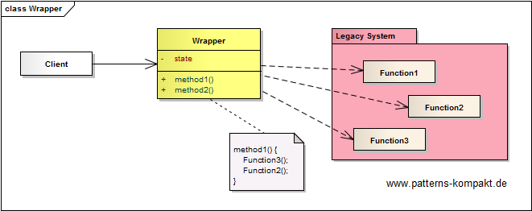
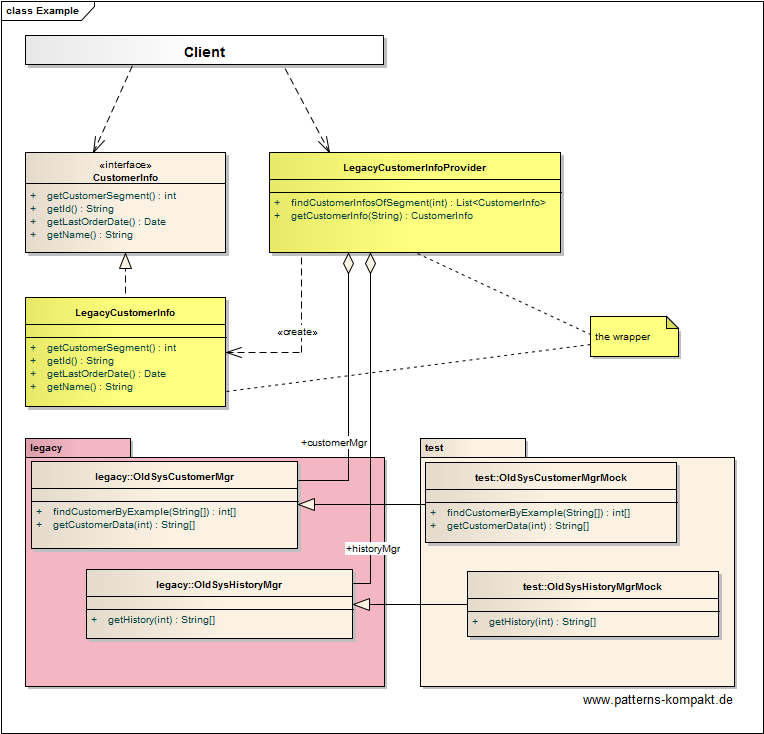

#### [Project Overview](../../../../../../../README.md)
----

# Wrapper

## Scenario

Multiglom Sillitek, vendor of the Product Management Suite PMS, step by step reworks the architecture of its software. It has been decided to write a new client-facing customer information module and rework the backend later resp. at a slower pace. A goal of the architects is keep the new modules decoupled from the legacy data model.

The team now faces the problem that the new client module expects _CustomerInfo_ instances while the old backend has all the required data but in different format spread over a couple of submodules.

## Choice of Pattern

In this scenario we want to apply the **Wrapper Pattern** to _avoid accessing low-level function-based API-calls directly. Instead wrap each related group of functions and data within such an API in a separate, cohesive wrapper facade class_ (POSA). 

In the scenario above our goal is to provide a modern cohesive access for the customer information system to the legacy system. The _CustomerInfo_ object expected by the client must be composed of results from multiple legacy API calls.

The solution is the introduction of the _LegacyCustomerInfoProvider_, a wrapper for the legacy system providing a modern API to the client. The _LegacyCustomerInfo_ implements the _CustomerInfo_ **interface** and contains the data assembled from legacy API calls behind the scenes.

## Try it out!

Open [WrapperTest.java](WrapperTest.java) to start playing with this pattern. By setting the log-level for this pattern to DEBUG in [logback.xml](../../../../../../../src/main/resources/logback.xml) you can watch the pattern working step by step.

## Remarks
* As demonstrated, the testing of wrapper functionality can be separated from the core system functionality (here the legacy API) by using mocks. But be aware that this kind of mocking completely ignores any _quality aspects_ (like latency or error behavior) of the wrapped API. This can lead to late surprises, sometimes even after rollout.
* _Wrapper_ aka _Wrapper [Facade](../facade/README.md)_ covers subsystems or APIs where [Decorator](../decorator/README.md) and [Adapter](../adapter/README.md) are typically about _wrapping_ a single class.

## References

* (POSA) Buschmann, F., Henney, K., Schmidt, D.C.: Pattern-Oriented Software Architecture: A Pattern Language for Distributed Computing. Wiley, Hoboken (NJ, USA) (2007)
* (GoF) Gamma, E., Helm, R., Johnson, R., Vlissides, J.: Design Patterns – Elements of Reusable Object-Oriented Software. Addison-Wesley (1995).

